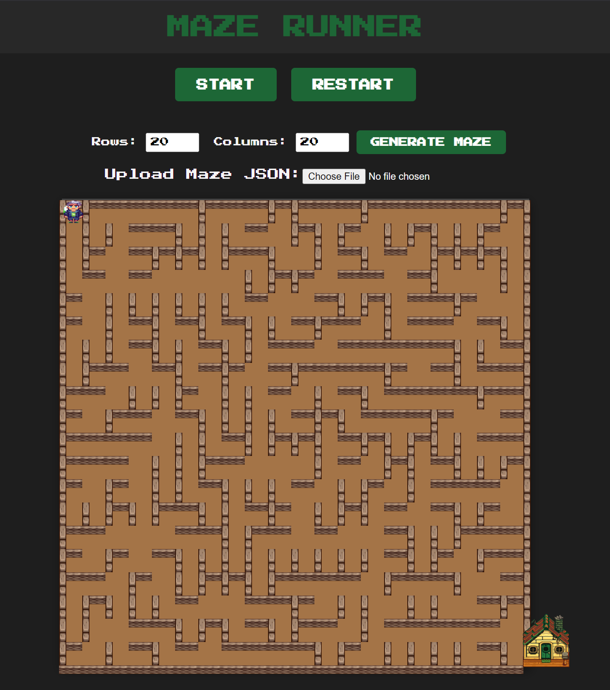

# Maze Solver Application



## Overview

The **Maze Solver Application** is an interactive web-based tool that generates mazes using **Prim's Algorithm**, visualizes them, and animates a character navigating from the start to the goal. Users can create custom mazes, upload predefined maze configurations, and watch the solving process with dynamic route highlighting and backtracking from dead ends.

## Features

- **Maze Generation:**
  - Create random mazes with customizable dimensions using Prim's Algorithm.
  - Ensure each maze has a unique path from start to goal.

- **Visualization:**
  - Render mazes using CSS Grid for a clear and responsive layout.
  - Display walls, start (`S`), and goal (house icon) markers accurately.

- **Route Finding and Animation:**
  - Implement Depth-First Search (DFS) with backtracking to find a path from start to goal.
  - Animate a character moving through the maze, highlighting the route and backtracking from dead ends.

- **User Interactions:**
  - **Generate Maze:** Specify rows and columns to create a new maze.
  - **Upload Maze:** Load predefined mazes from JSON files.
  - **Start/Pause Animation:** Control the character's movement.
  - **Restart Maze:** Reset the maze and animation.

- **Responsive Design:**
  - Compatible with various devices and screen sizes.

- **Error Handling:**
  - Provide user-friendly error messages for invalid inputs or file uploads.

## Technologies Used

- **Frontend:**
  - HTML5
  - CSS3 (CSS Grid)
  - JavaScript (ES6)

- **Assets:**
  - Images for the character and house icons.

## Installation

1. **Clone the Repository:**

   ```bash
   git clone https://github.com/ZenKhalil/Labyrint-solver.git
   ```

2. **Navigate to the Project Directory:**

    ```bash
    cd LABYRANT-SOLVER
    ```
3. **Open the Application:**

Open the index.html file in your preferred web browser.

# Usage

## Generate a New Maze
1. Enter the desired number of rows and columns (minimum 5) in the input fields.
2. Click the **"Generate Maze"** button to create and display the maze.

## Upload a Maze
1. Click on the file input to select and upload a maze JSON file.
2. Upon successful upload, the maze will be displayed, and the character will be placed at the start position.

## Start/Pause Animation
1. Click the **"START"** button to begin animating the character through the maze.
2. The button toggles to **"PAUSE,"** allowing you to halt the animation at any point.

## Restart Maze
1. Click the **"RESTART"** button to reset the maze and animation to their initial states.
2. This clears all route highlights and places the character back at the start.

## Congratulations Modal
1. Upon successfully navigating the maze, a congratulations modal will appear.
2. Click the close button (×) or outside the modal to dismiss it.

# Algorithms

## Maze Generation
- **Algorithm Used:** Prim's Algorithm
- *** https://en.wikipedia.org/wiki/Maze_generation_algorithm#Randomized_Prim's_algorithm ***
- *** https://www.geeksforgeeks.org/prims-minimum-spanning-tree-mst-greedy-algo-5/ ***


### Description
Prim's Algorithm generates a perfect maze by starting with a grid full of walls, selecting a random starting cell, and iteratively adding cells to the maze by removing walls between adjacent cells. This approach ensures a maze with multiple branches and interconnected pathways.

## Route Finding
- **Algorithm Used:** Depth-First Search (DFS) with Backtracking

### Description
DFS explores as far as possible along each branch before backtracking when it hits a dead end. This method effectively finds a path from the start to the goal, backtracking from dead ends to explore alternative routes.

# Data Structures

## Maze Grid
- Represented as a 2D array where each cell has properties indicating the presence of walls (north, east, south, west) and its inclusion in the maze (inMaze).

## Frontier List
- A list of walls adjacent to the current maze used in Prim's Algorithm to expand the maze.

## Stack
- Utilized in DFS for route finding to keep track of the path and facilitate backtracking from dead ends.

## Route Cells
- An array storing the sequence of cells forming the path from start to goal.


# Project Structure

- **images/**: Contains all image assets for the character and house.
- **styles.css**: Defines the styling for the maze, character, house, and UI elements.
- **script.js**: Implements core functionalities, including maze generation, route finding, animation, and user interactions.
- **mazeGenerator.js**: Contains functions related to maze creation using Prim's Algorithm.
- **index.html**: The main HTML file rendering the application's UI.
- **README.md**: Documentation for the project.


# Contributing

Contributions are welcome! To enhance the Maze Solver Application, please follow these steps:

## Fork the Repository
1. Click the **"Fork"** button at the top-right corner of the repository page.

## Clone Your Fork
```bash
git clone https://github.com/ZenKhalil/Labyrint-solver.git
cd maze-solver
```
## Create a New Branch
```bash
git checkout -b feature/YourFeatureName
```

## Make Changes and Commit
```bash
git commit -m "Add your descriptive commit message here"
```

## License
This project is licensed under the MIT License.